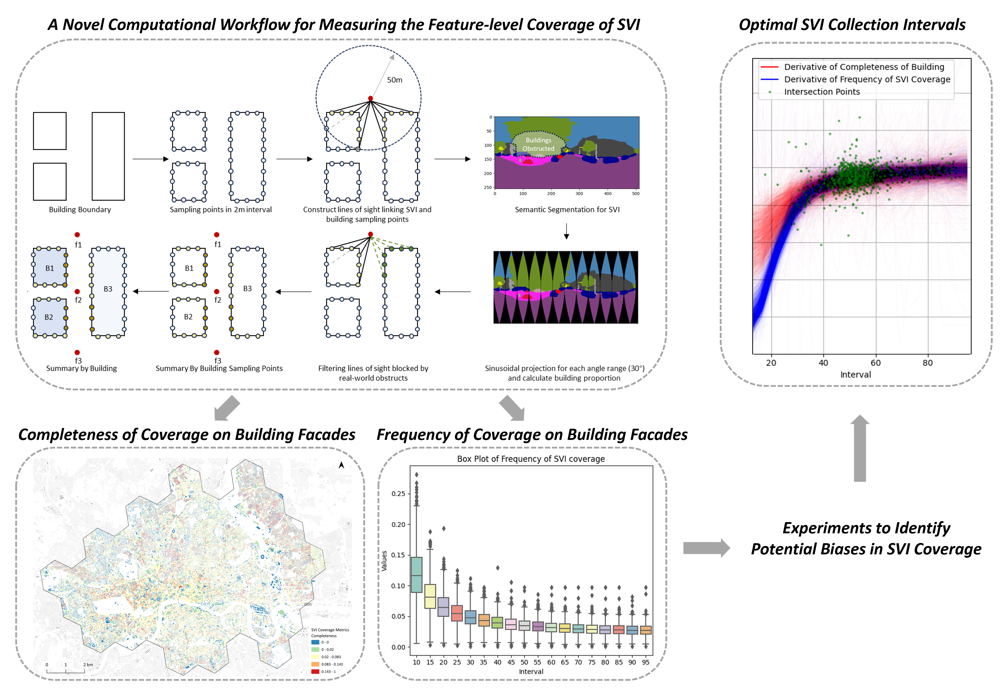
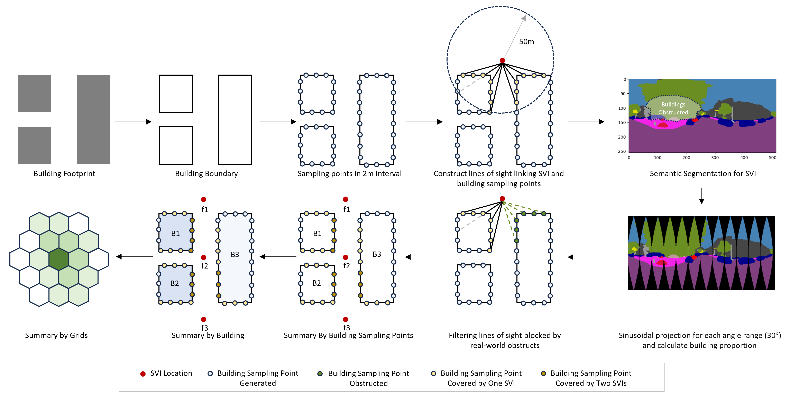
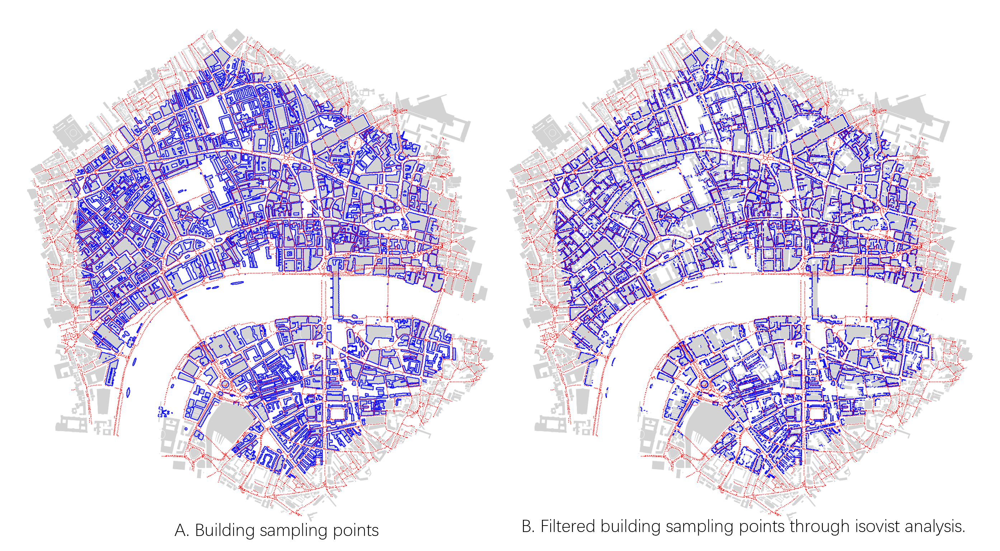
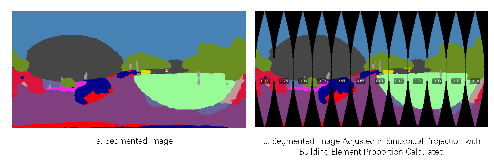
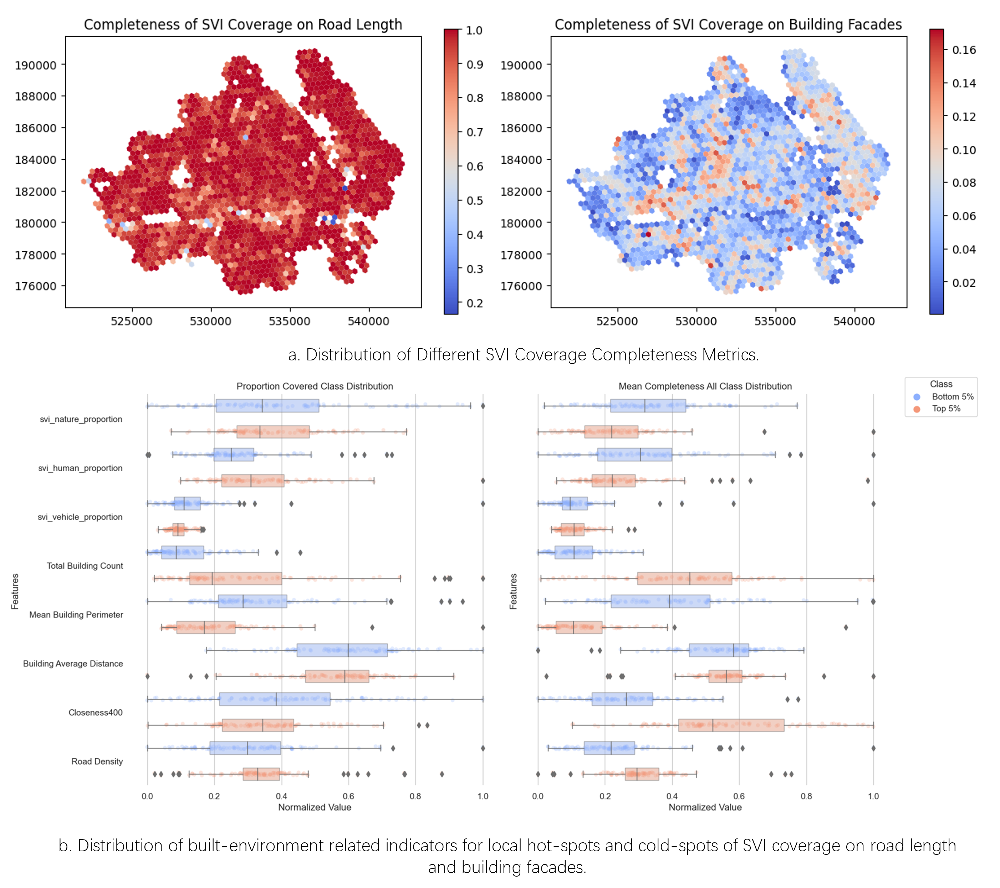
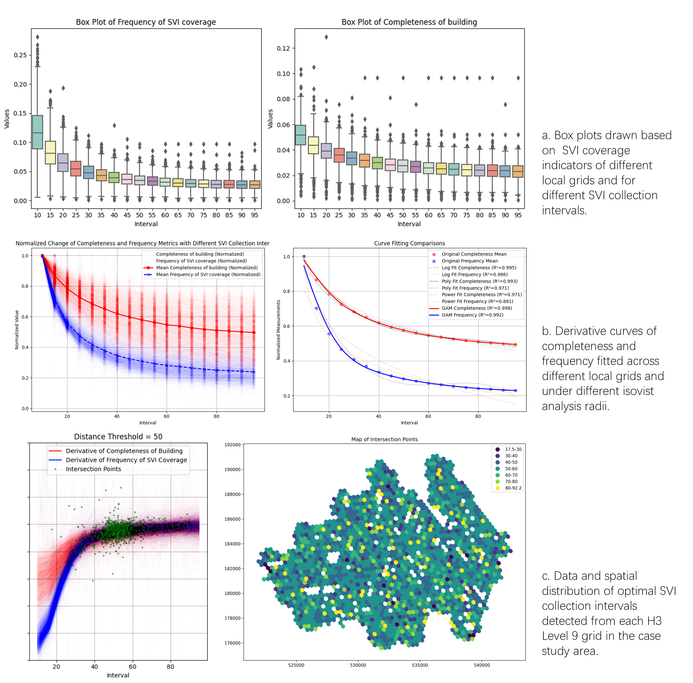

# SVI Coverage and Bias
[](https://creativecommons.org/licenses/by-sa/4.0/)

Repository for releasing the code used in **Coverage and bias of street view imagery in mapping the urban environment**, developed by [Zicheng Fan](https://ual.sg/author/zicheng-fan/) from [Urban Analytics Lab (UAL)](https://ual.sg/), National University of Singapore (NUS).

The journal paper can be found [here](https://doi.org/10.1016/j.compenvurbsys.2025.102253).


 ## A Workflow for Estimating SVI Coverage of Building Facades
In this project, focusing on the dual nature of Street View Imagery (SVI)—both as vector data with geographic location and orientation and as image data capturing real-world objects—we explore a computational workflow to estimate SVI's coverage of urban building elements.


 ### Isovist Analysis


 ### Linking Isovist Results to Image Contents
 

## Indicator System for describing SVI Coverage Extent
| Dimensions  | Metrics                                                   | Description                                                                                                                                                              |
|-------------|-----------------------------------------------------------|--------------------------------------------------------------------------------------------------------------------------------------------------------------------------|
| **Building Level** | **Completeness of SVI Coverage for Individual Building (CoC-B)** | Proportion of SVI-covered sampling points relative to the total available sampling points for a single building.                                                         |
|             | **Frequency of SVI Coverage for Individual Building (FoC-B)** | Number of occurrences SVI achieves coverage around a single building, adjusted for building perimeter.                                                                    |
| **Area Level**     | **Completeness of SVI Coverage on Buildings in Local Area (CoC-A)** | Proportion of SVI-covered buildings relative to the total number of buildings in a local area.                                                                            |
|             | **Frequency of SVI Coverage on Buildings in Local Area (FoC-A)** | Sum of SVI coverage frequency for specific building types (not adjusted), relative to the total SVI coverage frequency for all buildings in the local area. |


## Expperiment 1 - Potential bias in the SVI covered building information

For the Experiment 1, the study aims to detect the potential bias of SVI in representing building information. To begin with, we hope to know whether SVI coverage achieves an even distribution across buildings of different function types and sizes, or it is prone to highlight or ignore specific buildings in the built environment.
The experiment is conducted by comparing interior distribution of the building-level SVI coverage completeness indicator, across buildings grouped by building types and sizes. Furthermore, we hope to learn whether the SVI captured building information is representative of the building in reality.

 


##  Expperiment 2 - Poorly Represented Neighborhoods in SVI
In the Experiment 2, we aim to identify neighborhoods that are not adequately represented in SVI. This investigation is based on the hypothesis that even if SVI provides sufficient coverage in terms of spatial distribution within a neighborhood, it may still lack adequate coverage on building facades or on other environmental elements. Consequently, this insufficiency might hinder a comprehensive representation of the built environment within the neighborhood. The experiment is conducted by comparing the spatial distribution of traditionally adopted SVI coverage indicator with the spatial distribution of new coverage indicators proposed in this study. We further compare the local built environment features, such as road density and centrality, building size, count and distance, and proportion of street view elements of greenery, vehicle and human, between the typical hot-spots and cold-spots of above coverage indicators.

 

## Experiment 3 - Impact of Collection Interval on SVI Coverage

In the Experiment 3, we aim to investigate the stability of SVI coverage on building facades in terms of different SVI collection intervals. This investigation is based on the hypothesis that smaller collection interval will increase both the completeness and frequency of SVI coverage on the built environment, enhancing the information density, but may not suit best for urban research due to the extra redundancies introduced and the uncertainty in distribution. On this basis, Experiment 3 explores whether there is an optimal SVI collection interval helping improve the reliability of SVI based urban research.

 


## Paper / Citation

If the project benefits your work, please cite the [paper](https://doi.org/10.1016/j.compenvurbsys.2025.102253): 

Fan, Z., Feng, C.-C., Biljecki, F., 2025. Coverage and bias of street view imagery in mapping the urban environment. Computers, Environment and Urban Systems 117, 102253. doi: [https://doi.org/10.1016/j.compenvurbsys.2025.102253](https://doi.org/10.1016/j.compenvurbsys.2025.102253)


BibTeX:
```
@article{fan_coverage_2025,
	title = {Coverage and bias of street view imagery in mapping the urban environment},
	volume = {117},
	doi = {10.1016/j.compenvurbsys.2025.102253},
	pages = {102253},
	journal= {Computers, Environment and Urban Systems},
	author = {Fan, Zicheng and Feng, Chen-Chieh and Biljecki, Filip},
 	year = {2025},
}

```


